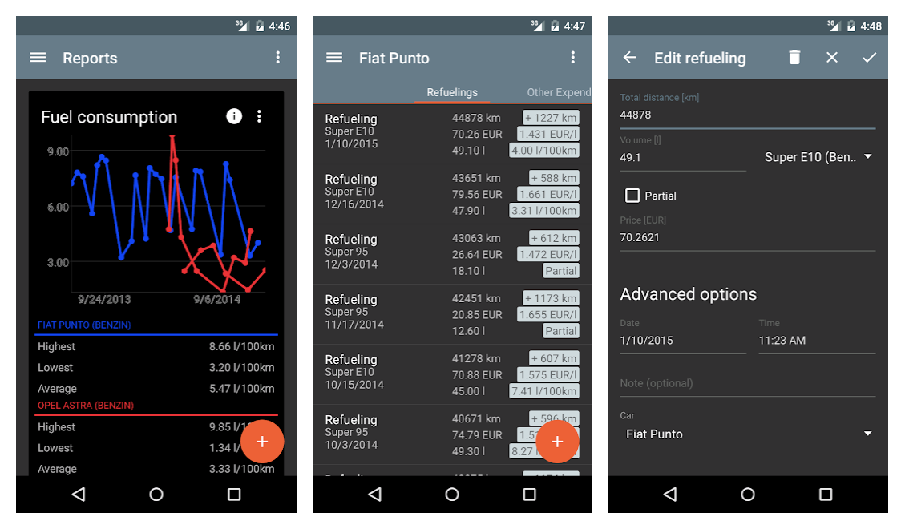
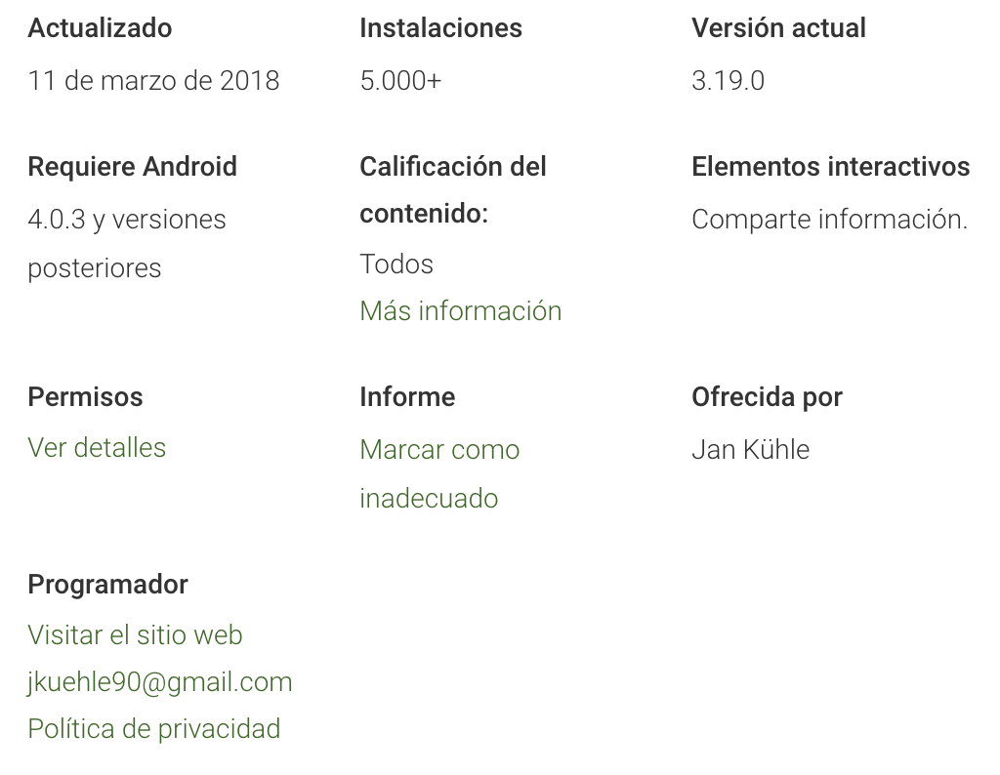
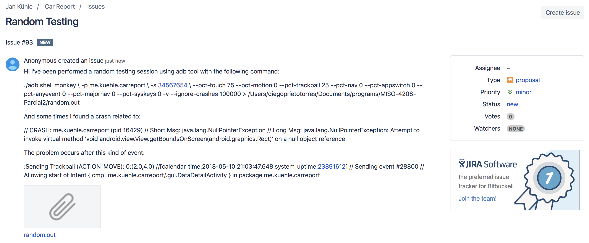
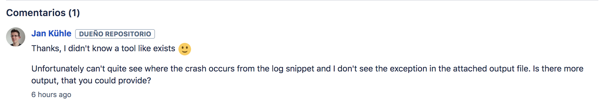
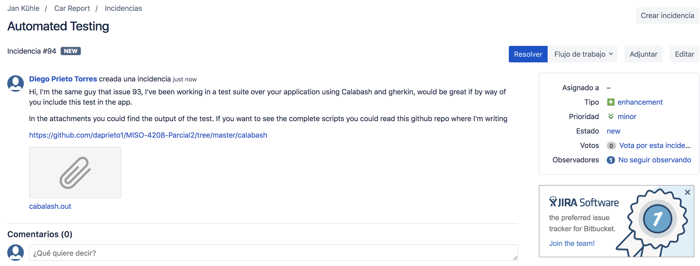

# Estrategia de pruebas - Parcial 2

---

apps:
* cabalash
* adb events
* barista
* android recorder / runner
* reran
* android junit runner

## Cracterísticas de la App

**Car Report**

La aplicación sirve para obtener una idea acerca de los gastos del vehículo. Los tipos de costos a recolectar pueden ser:

1. Consumo de gasolina
2. Precio de la gasolina
3. Recorrido
4. Promedio de costo del carro por día, mes y año

Con esa información es posible usar características adicionales y que son calculos simples como:

* cuánto cuestan 5 litros de gasolina?
* Costo de reparaciones e impuestos
* Sincronizar datos con Dropbox etc
* Recordatorios de mantenimiento



La aplicación cuenta con `52` reviews y una calificación de `4.1` en Google Play.


**Permisos Requeridos:** _Network access_: Usado para sincronizar con Dropbox/Google Drive/WebDAV. _Manage acounts_. _Escritura en SD_. _Run at startup_: Usado para mostrar recordatorios cuando se reinice el dispositivo.

* android.permission.WRITE_EXTERNAL_STORAGE
* android.permission.INTERNET
* android.permission.READ_SYNC_SETTINGS
* android.permission.WRITE_SYNC_SETTINGS
* android.permission.READ_SYNC_STATS
* android.permission.GET_ACCOUNTS (?)
* android.permission.MANAGE_ACCOUNTS (?)
* android.permission.AUTHENTICATE_ACCOUNTS (?)
* android.permission.USE_CREDENTIALS (?)
* android.permission.RECEIVE_BOOT_COMPLETED
* android.permission.READ_EXTERNAL_STORAGE

**Licencia:** Apache License 2.0 

**Version:** 3.19.0 liberada el 2018-03-15

**Version de Android mínima:** 4.0.3



## Contexto

### Objetivo

* Realizar Pruebas exploratorias sobre la aplicación movil AntenaPod para conocer cuales son sus principales funcionalidades.
* Evaluar la calidad de la suite de pruebas usando un proceso de Mutation Testing.
* Evaluar la tolerancia a fallos de la aplicación realizando un proceso de Random Testing sobre los mutantes generados, de lat forma se logrará medir la capacidad funcional de la aplicación con defectos inyectados.
* Reportar posibles puntos de mejora sobre la suite de pruebas para que sea más madura.
* Reportar en GitHub
* Automatizar escenarios básicos que no esten contemplados en la suite de pruebas y que pueden ser incluidos

### Niveles y tipos de prueba

**Unitarias**

* Se ejecutarán las pruebas unitarias que están incluidas en el APK para cada mutante.

**Sistema**

* Se realizará un proceso de Random Testing sobre el APK instalado en un dispositivo Android emulado probando la aplicación como un sistema completo.

**Aceptación**

* Durante el proceso de exploración se realizara una prueba de aceptación en un dispositivo Android real de forma manual.

### Infraestructura de pruebas

**Hardware:**

* Computador Mac con sistema operativo OSX High Sierra, 16GB RAM, 512GB estado solido, core i7.
* Celular Xperia Z3 con sistema operativo Android Oreo.
* Emulador Nexus 5, API 26, Android 8.0, 2GB

**Software:**

* Android Studio
* adb
* Car Report original APK provista por el monitor de la clase como la versión estable de la aplicación.
* Car Report APK's mutantes provistos por el monitor de la clase como la versión inestable de la aplicación.
* Calabash para automatización de pruebas sobre Android
* GifRecoder para grabar evidencia de ejecución de pruebas de aceptación, errores de ejecución etc.
* Aplicación original descargada y compilada desde el repositorio base.

**Recurso Humano:**

1 desarrollador trabajando 2 horas diarias durante 5 días continuos.

### Calendario e integración con desarrollo

No va a existir integración con desarrollo aunque de ser posible _issues_ pueden ser reportados en el repositorio de código fuente de la aplicación.

El proceso de pruebas comienza el día 9/5/18 a las 19:30 y acaba el día 14/5/18 a las 23:55.

El proceso a seguir para encontrar los defectos detectados en los mutantes es:

1. Instalar APK 
2. Ejecutar pruebas de calabash
3. Ejecutar random testing
4. Ejecutar pruebas unitarias

* Primero se va a realizar el proceso sobre el APK original con el objetivo de encontrar una muestra base del comportamiento de la aplicación sin defectos inyectados, esta prueba inicial busca determinar la cantidad de defectos que pueden ser hallados usando las pruebas unitarias del desarrollador inicial, las pruebas de Calabash codificadas por mi y una seria de eventos aleatorios generados por la herramienta de random testing de android.

## Resultados

| APK | Calabash Escenarios | Cabalash duración |Random Error | random duración|conclusión |
|---|---|---|---|---|---|
|original|19/19|3m28.285s|NO|234518ms|estable|
|5 mutante|18/19|3m53.680s|NO|330011ms|Errores visuales (color naranja)|
|8 mutante|15/19|4m55.155s|SI|72458ms|java.lang.NullPointerException - [conclusiones mutante 8](resultados/8-mutante/README.md)|
|9 mutante|19/19|3m43.625s|SI|210130ms|java.lang.NullPointerException - [conclusiones mutante 9](resultados/9-mutante/README.md)|
|9 mutante|/19|||||
|41 mutante|19/19|3m37.600s|NO|244985ms|estable|
|42 mutante|19/19|3m37.620s|SI|176332ms|java.lang.NullPointerException - [conclusiones mutante 42](resultados/42-mutante/README.md)|
|43 mutante|19/19|3m32.476s|NO|370567ms|estable|
|44 mutante|18/19|3m54.200s|SI|29251ms|java.lang.NullPointerException - [conclusiones mutante 44](resultados/44-mutante/README.md)|
|45 mutante|19/19|3m25.530s|NO|156418ms|estable|
|46 mutante|19/19|3m26.017s|SI|31678ms|java.lang.NullPointerException - [conclusiones mutante 46](resultados/46-mutante/README.md)|
|47 mutante|19/19|3m18.360s|NO|170388ms|estable|
|48 mutante|19/19|3m24.933s|SI|150979ms|java.lang.NullPointerException - [conclusiones mutante 48](resultados/48-mutante/README.md)|
|49 mutante|19/19|3m24.799s|NO|170411ms|estable|
|52 mutante|19/19|3m20.089s|SI|170674ms|java.lang.NullPointerException - [conclusiones mutante 52](resultados/52-mutante/README.md)|
|53 mutante|19/19|3m27.657s|SI|174535ms|java.lang.NullPointerException - [conclusiones mutante 53](resultados/53-mutante/README.md)|
|54 mutante|19/19|3m54.067s|SI|233473ms|java.lang.NullPointerException - [conclusiones mutante 54](resultados/54-mutante/README.md)|
|55 mutante|19/19|3m30.622s|SI|210130ms|java.lang.NullPointerException - [conclusiones mutante 55](resultados/55-mutante/README.md)|
|58 mutante|0/19|4m15.973s|SI||multiples errores visuales y java.lang.NullPointerException - [conclusiones mutante 58](resultados/58-mutante/README.md)|
|59 mutante|17/19|4m11.121s|NO|138241ms|errores importando y exportando - [conclusiones mutante 59](resultados/59-mutante/README.md)|
|60 mutante|17/19||NO|138241ms|errores importando y exportando - [conclusiones mutante 60](resultados/60-mutante/README.md)|
|61 mutante|19/19|3m37.967s||||
|62 mutante|6/19|4m48.480s|||multiples fallos en crear auto - [conclusiones mutante 62](resultados/62-mutante/README.md)|
|63 mutante|19/19|3m17.817s||||
|64 mutante|17/19|4m11.532s|||errores importando y exportando - [conclusiones mutante 64](resultados/64-mutante/README.md)|
|65 mutante|19/19|3m14.848s||||
|66 mutante|19/19|3m15.977s||||
|67 mutante|19/19|3m25.318s||||
|68 mutante|19/19|3m31.368s||||
|70 mutante|19/19|3m26.774s||||
|73 mutante|19/19|3m22.906s||||
|74 mutante|19/19|3m29.291s||||
|75 mutante|19/19|3m26.773s||||
|76 mutante|19/19|3m19.805s||||
|77 mutante|19/19|3m14.694s||||
|78 mutante|19/19|3m23.838s||||
|79 mutante|19/19|3m29.725s||||
|80 mutante|19/19|3m21.524s||||
|81 mutante|19/19|3m17.876s||||
|82 mutante|19/19|3m16.232s||||
|83 mutante|19/19|3m12.646s||||
|84 mutante|19/19|3m13.605s||||
|85 mutante|19/19|3m14.877s||||
|86 mutante|19/19|3m13.947s||||
|89 mutante|19/19|3m14.770s||||
|92 mutante|19/19|3m16.465s||||
|93 mutante|19/19|3m16.544s||||
|94 mutante|19/19|3m12.437s||||
|95 mutante|1/19|8m48.328s|||multiples fallos en crear auto - [conclusiones mutante 95](resultados/95-mutante/README.md)|
|96 mutante|1/19|0m7.917s|||problemas iniciando el app - [conclusiones mutante 96](resultados/96-mutante/README.md)|
|97 mutante|19/19|3m16.868s||||
|98 mutante|19/19|3m18.528s||||
|99 mutante|19/19|3m11.629s||||
|123 mutante|19/19|3m15.174s||||
|171 mutante|19/19|3m13.246s||||
|251 mutante|19/19|3m15.957s||||
|270 mutante|19/19|3m14.589s||||
|292 mutante|19/19|3m14.262s||||
|305 mutante|0/19|7m48.348s|||problemas iniciando el app - [conclusiones mutante 305](resultados/305-mutante/README.md)|
|306 mutante|0/19|7m47.217s|||problemas iniciando el app - [conclusiones mutante 306](resultados/306-mutante/README.md)|
|307 mutante|0/19|7m48.771s|||problemas iniciando el app - [conclusiones mutante 307](resultados/307-mutante/README.md)|
|308 mutante|0/19|7m47.583s|||problemas iniciando el app - [conclusiones mutante 308](resultados/308-mutante/README.md)|
|310 mutante|19/19|3m30.859s||||
|325 mutante|19/19|3m18.630s||||
|334 mutante|18/19|3m45.809s|||problemas creando auto con botón + - [conclusiones mutante 334](resultados/334-mutante/README.md)|
|335 mutante|18/19|3m47.990s|||problemas creando tipo combustible - [conclusiones mutante 335](resultados/335-mutante/README.md)|
|338 mutante|19/19|3m16.871s||||
|340 mutante|19/19|3m13.269s||||
|341 mutante|19/19|3m20.177s||||
|342 mutante|19/19|3m17.904s||||
|346 mutante|/19|||||
|347 mutante|/19|||||
|352 mutante|/19|||||
|354 mutante|/19|||||

## Issues en repositorio de Car Report

### Random Testing

Se ha creado un issue en el repositorio oficial de Car Report relacionado a un inconveniente al momento de ejecutar random testing sobre la aplicación original. Ese error es el siguiente:

```
// CRASH: me.kuehle.carreport (pid 16429) 
// Short Msg: java.lang.NullPointerException 
// Long Msg: java.lang.NullPointerException: Attempt to invoke virtual method 'void android.view.View.getBoundsOnScreen(android.graphics.Rect)' on a null object reference
```

Y se produce generalmente después del evento:

```
:Sending Trackball (ACTION_MOVE): 0:(2.0,4.0) //[calendar_time:2018-05-10 21:03:47.648 system_uptime:23891612] // Sending event #28800 // Allowing start of Intent { cmp=me.kuehle.carreport/.gui.DataDetailActivity } in package me.kuehle.carreport
```

Usted puede acceder al issue en la siguiente [URL](https://bitbucket.org/frigus02/car-report/issues/93/random-testing)





### BDT

Se ha creado un issue en el repositorio oficial de Car Report mencionando que sería buena idea incluir las pruebas de flujos completos construidas con cabalash como parte del proyecto, para de esta forma aumentar la solidez de la aplicación.

Usted puede acceder al issue en la siguiente [URL](https://bitbucket.org/frigus02/car-report/issues/94/random-testing)



## Referencias

* [Car Report](https://f-droid.org/en/packages/me.kuehle.carreport/)
* [Car Report - Google Play](https://play.google.com/store/apps/details?id=me.kuehle.carreport)
* [Car Report - BitBucket repo](https://bitbucket.org/frigus02/car-report)


