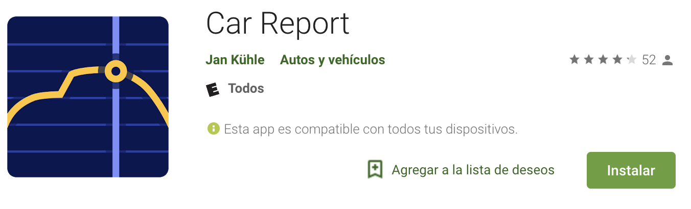

# Estrategia de pruebas - Parcial 2

---

apps:
* cabalash
* adb events
* barista
* android recorder / runner
* reran
* android junit runner

## Cracterísticas de la App

**Car Report**

La aplicación sirve para obtener una idea acerca de los gastos del vehículo. Los tipos de costos a recolectar pueden ser:

1. Consumo de gasolina
2. Precio de la gasolina
3. Recorrido
4. Promedio de costo del carro por día, mes y año

Con esa información es posible usar características adicionales y que son calculos simples como:

* cuánto cuestan 5 litros de gasolina?
* Costo de reparaciones e impuestos
* Sincronizar datos con Dropbox etc
* Recordatorios de mantenimiento

La aplicación cuenta con `52` reviews y una calificación de `4.1` en Google Play.

**Permisos Requeridos:** _Network access_: Usado para sincronizar con Dropbox/Google Drive/WebDAV. _Manage acounts_. _Escritura en SD_. _Run at startup_: Usado para mostrar recordatorios cuando se reinice el dispositivo.

* android.permission.WRITE_EXTERNAL_STORAGE
* android.permission.INTERNET
* android.permission.READ_SYNC_SETTINGS
* android.permission.WRITE_SYNC_SETTINGS
* android.permission.READ_SYNC_STATS
* android.permission.GET_ACCOUNTS (?)
* android.permission.MANAGE_ACCOUNTS (?)
* android.permission.AUTHENTICATE_ACCOUNTS (?)
* android.permission.USE_CREDENTIALS (?)
* android.permission.RECEIVE_BOOT_COMPLETED
* android.permission.READ_EXTERNAL_STORAGE

**Licencia:** Apache License 2.0 

**Version:** 3.19.0 liberada el 2018-03-15

**Version de Android mínima:** 4.0.3

## Contexto

### Objetivo

* Realizar Pruebas exploratorias sobre la aplicación movil AntenaPod para conocer cuales son sus principales funcionalidades.
* Evaluar la calidad de la suite de pruebas usando un proceso de Mutation Testing.
* Evaluar la tolerancia a fallos de la aplicación realizando un proceso de Random Testing sobre los mutantes generados, de lat forma se logrará medir la capacidad funcional de la aplicación con defectos inyectados.
* Reportar posibles puntos de mejora sobre la suite de pruebas para que sea más madura.
* Reportar en GitHub
* Automatizar escenarios básicos que no esten contemplados en la suite de pruebas y que pueden ser incluidos

### Niveles y tipos de prueba

**Unitarias**

* Se ejecutarán las pruebas unitarias que están incluidas en el APK para cada mutante.

**Sistema**

* Se realizará un proceso de Random Testing sobre el APK instalado en un dispositivo Android emulado probando la aplicación como un sistema completo.

**Aceptación**

* Durante el proceso de exploración se realizara una prueba de aceptación en un dispositivo Android real de forma manual.

### Infraestructura de pruebas

**Hardware:**

* Computador Mac con sistema operativo OSX High Sierra, 16GB RAM, 512GB estado solido, core i7.
* Celular Xperia Z3 con sistema operativo Android Oreo.
* Emulador Nexus 5, API 26, Android 8.0, 2GB

**Software:**

* Android Studio
* adb
* Car Report original APK provista por el monitor de la clase como la versión estable de la aplicación.
* Car Report APK's mutantes provistos por el monitor de la clase como la versión inestable de la aplicación.
* Calabash para automatización de pruebas sobre Android
* GifRecoder para grabar evidencia de ejecución de pruebas de aceptación, errores de ejecución etc.
* Aplicación original descargada y compilada desde el repositorio base.

**Recurso Humano:**

1 desarrollador trabajando 2 horas diarias durante 5 días continuos.

### Calendario e integración con desarrollo

No va a existir integración con desarrollo aunque de ser posible _issues_ pueden ser reportados en el repositorio de código fuente de la aplicación.

El proceso de pruebas comienza el día 9/5/18 a las 19:30 y acaba el día 14/5/18 a las 23:55.

## Referencias

* [Car Report](https://f-droid.org/en/packages/me.kuehle.carreport/)
* [Car Report - Google Play](https://play.google.com/store/apps/details?id=me.kuehle.carreport)
* [Car Report - BitBucket repo](https://bitbucket.org/frigus02/car-report)

Proceso
1. Instalar APK
2. Ejecutar pruebas con calabash => instala la app
3. Ejecutar random testing
4. ejecutar pruebas unitarias

