# Mutante 9

--

**Error :** SI
**Tipo Mutante :** Trivial

```
// CRASH: me.kuehle.carreport (pid 10492)
// Short Msg: java.lang.NullPointerException
// Long Msg: java.lang.NullPointerException: Attempt to invoke virtual method 'void android.view.View.setVisibility(int)' on a null object reference
// Build Label: google/sdk_gphone_x86/generic_x86:8.0.0/OSR1.170901.043/4456315:user/release-keys
// Build Changelist: 4456315
// Build Time: 1510873337000
// java.lang.NullPointerException: Attempt to invoke virtual method 'void android.view.View.setVisibility(int)' on a null object reference
// 	at me.kuehle.carreport.gui.m$3.onAnimationEnd(Unknown Source:7)
// 	at android.animation.Animator$AnimatorListener.onAnimationEnd(Animator.java:552)
// 	at android.animation.AnimatorSet.endAnimation(AnimatorSet.java:1293)
// 	at android.animation.AnimatorSet.cancel(AnimatorSet.java:429)
// 	at me.kuehle.carreport.gui.m.a(Unknown Source:16)
// 	at me.kuehle.carreport.gui.m$b$3.onClick(Unknown Source:16)
// 	at android.view.View.performClick(View.java:6256)
// 	at android.view.View$PerformClick.run(View.java:24701)
// 	at android.os.Handler.handleCallback(Handler.java:789)
// 	at android.os.Handler.dispatchMessage(Handler.java:98)
// 	at android.os.Looper.loop(Looper.java:164)
// 	at android.app.ActivityThread.main(ActivityThread.java:6541)
// 	at java.lang.reflect.Method.invoke(Native Method)
// 	at com.android.internal.os.Zygote$MethodAndArgsCaller.run(Zygote.java:240)
// 	at com.android.internal.os.ZygoteInit.main(ZygoteInit.java:767)
//
```

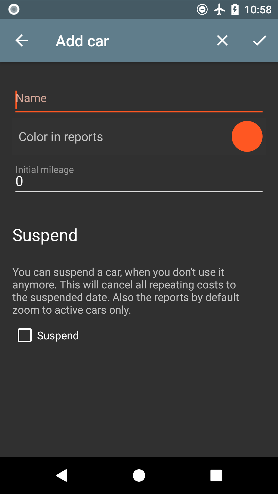
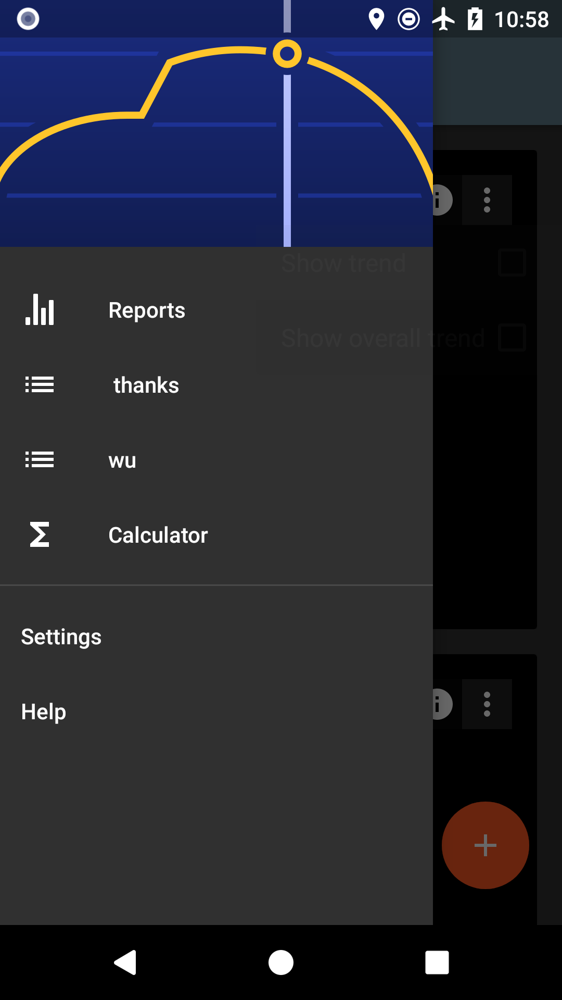
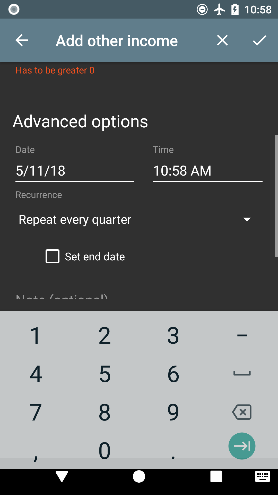
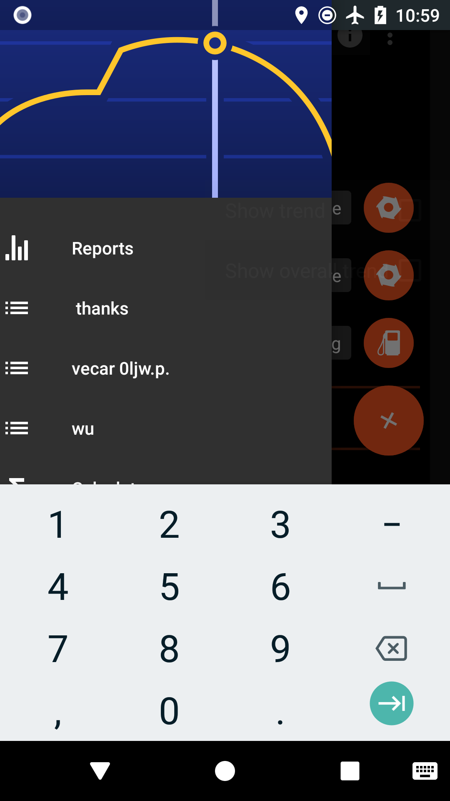
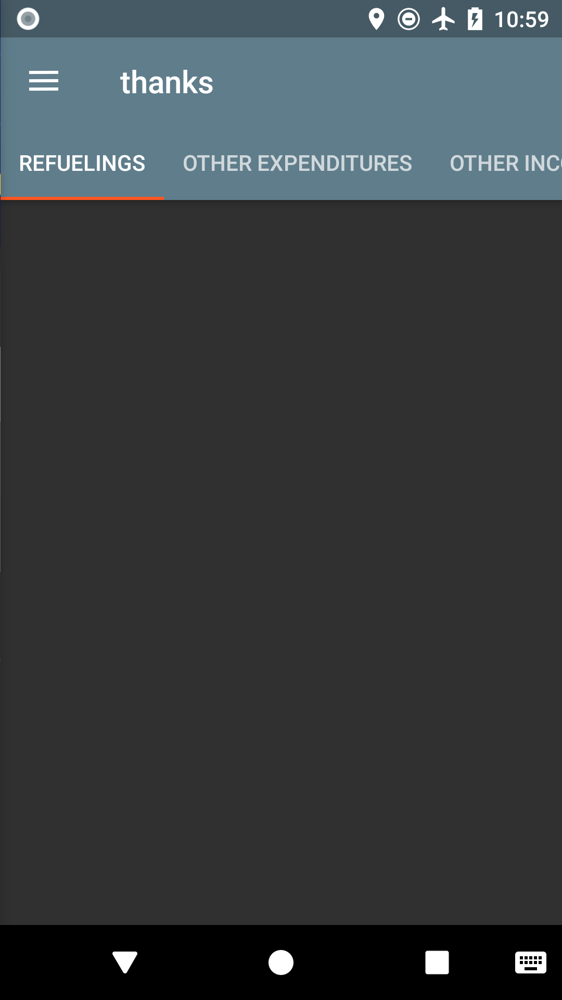

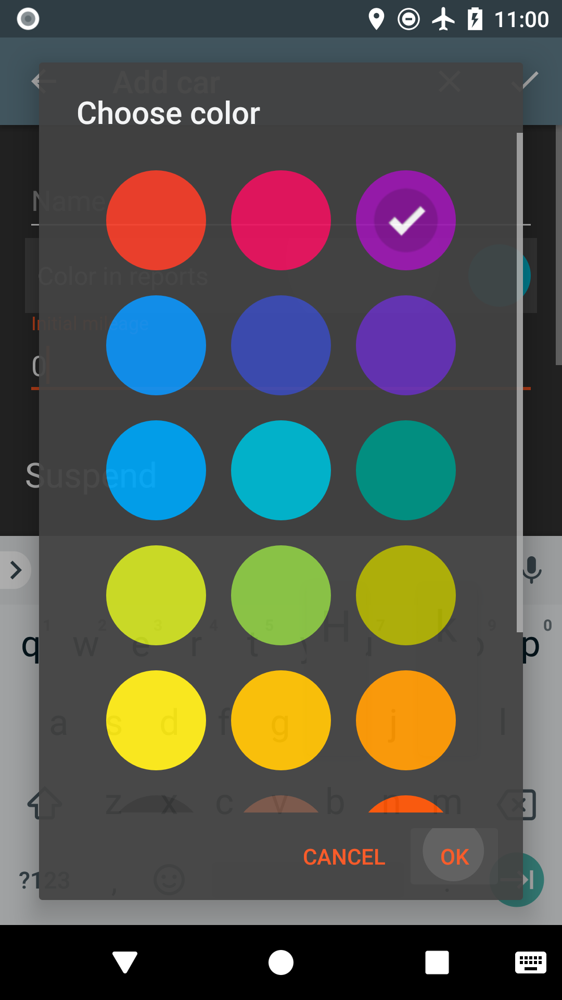
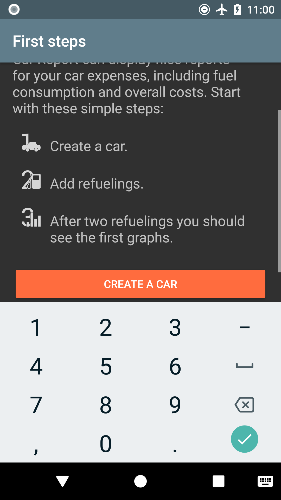
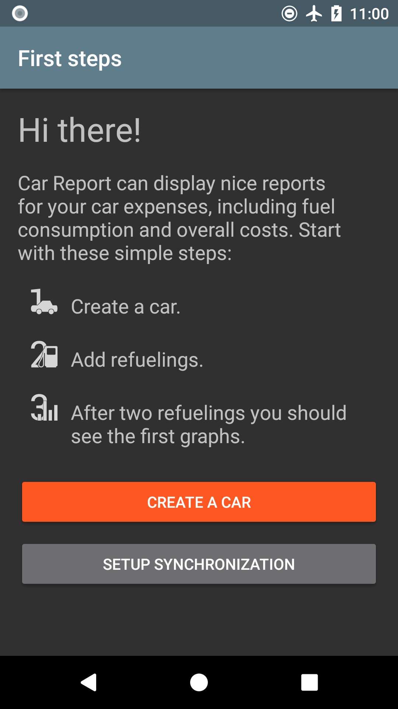
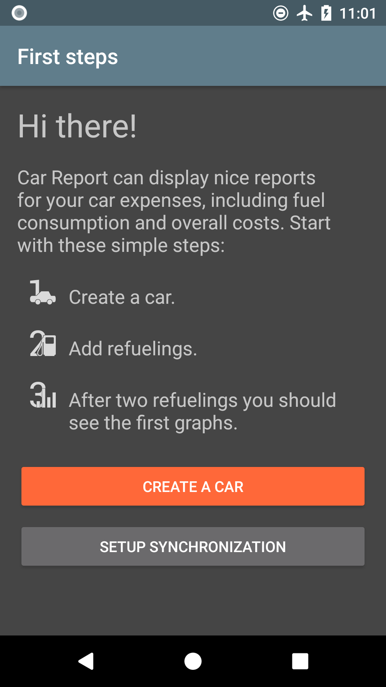
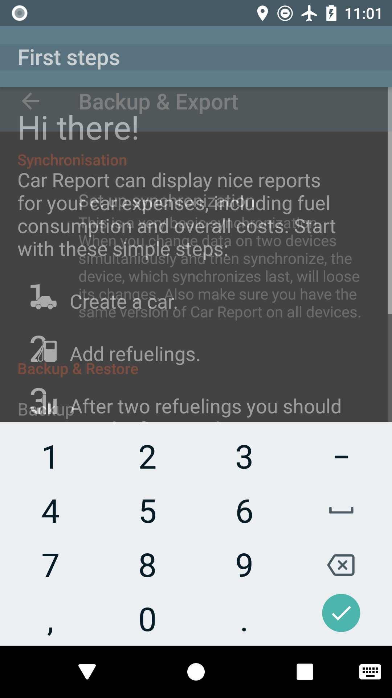
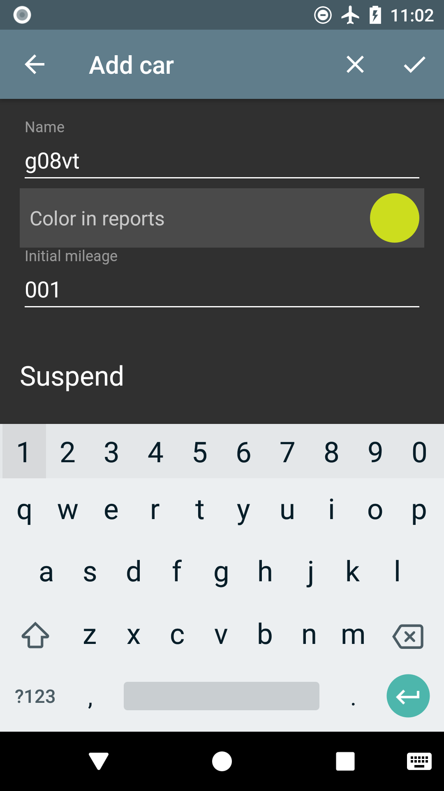


